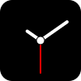

# Clock


<div align="center">
  
</div>

<br/>

A minimalist analog clock, made for old phones and tablets.

- Switch between styles by clicking anywhere on the screen -> settings button.
    - The style name is saved in the URL (param) and localStorage.
- Supports dark and light themes.
- Devices with the same time will tick together.

## Install

This App can be installed as a WebApp using the browser. This way it can be opened as a standalone app.

- Chrome -> menu -> Create Shortcut...
- iOS Safari -> share -> Add to Home Screen.
- macOS Safari -> Share -> Add to Dock


## Dev

This is a basic HTML/CSS/JS project without any build step.

To run a local server for development, you can use `live-server`.

```bash
npm install -g live-server
live-server

# or if you have Python 3 installed
python3 -m http.server
# This will serve the files at http://localhost:8000
```
