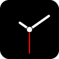

# Clock

  

 

A minimalist analog clock, made for old phones and tablets.

- Switch between styles by clicking anywhere on the screen.
    - The style name is saved in the URL (param) and localStorage.
- Supports dark and light themes set by the user's system preferences.
- Devices with the same time will tick together.

## Install

This App can be installed as a WebApp using the browser. This way it can be opened as a standalone app.

- Chrome -> menu -> Create Shortcut...
- iOS Safari -> share -> Add to Home Screen.
- macOS Safari -> Share -> Add to Dock
